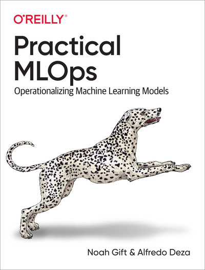

# Practical MLOps

El principal desafío del aprendizaje automático reside en poner en producción tus modelos. MLOps ofrece un conjunto de principios probados para resolver este problema de forma fiable y automatizada. Esta completa guía te explica qué es MLOps (y en qué se diferencia de DevOps) y te muestra cómo implementarlo para poner en práctica tus modelos de aprendizaje automático.

Los ingenieros de aprendizaje automático, tanto principiantes como experimentados, o cualquier persona familiarizada con la ciencia de datos y Python, adquirirán una base sólida en herramientas y métodos de MLOps (junto con AutoML, monitorización y registro de eventos), para luego aprender a implementarlos en AWS, Microsoft Azure y Google Cloud. Cuanto más rápido implemente un sistema de aprendizaje automático funcional, antes podrá centrarse en resolver los problemas de negocio que busca solucionar. Este libro le ofrece una ventaja inicial.

Descubrirás cómo:

- Aplicar las mejores prácticas de DevOps al aprendizaje automático
- Construir y mantener sistemas de aprendizaje automático de producción.
- Supervisar, instrumentar, someter a pruebas de carga y poner en funcionamiento los sistemas de aprendizaje automático.
- Elija las herramientas MLOps adecuadas para una tarea de aprendizaje automático determinada.
- Ejecuta modelos de aprendizaje automático en una variedad de plataformas y dispositivos, incluidos teléfonos móviles y hardware especializado.

