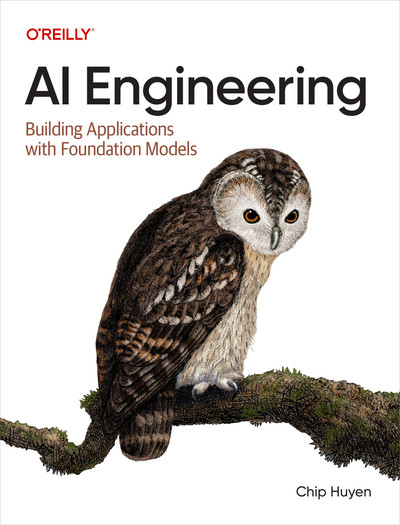

# AI Engineer

Los recientes avances en IA no solo han aumentado la demanda de productos de IA, sino que también han reducido las barreras de entrada para quienes desean desarrollarlos. El enfoque de modelo como servicio ha transformado la IA de una disciplina esotérica en una potente herramienta de desarrollo al alcance de todos. Cualquier persona, incluso aquellas con poca o ninguna experiencia previa en IA, puede ahora aprovechar los modelos de IA para crear aplicaciones. En este libro, el autor Chip Huyen analiza la ingeniería de IA: el proceso de creación de aplicaciones con modelos base fácilmente disponibles.

El libro comienza con una introducción a la ingeniería de IA, explicando sus diferencias con la ingeniería de aprendizaje automático tradicional y analizando la nueva arquitectura de IA. Cuanto más se utiliza la IA, mayores son las posibilidades de fallos catastróficos y, por lo tanto, más importante se vuelve la evaluación. Este libro analiza diferentes enfoques para evaluar modelos abiertos, incluyendo el enfoque de la IA como juez, que está en rápido crecimiento.

Los desarrolladores de aplicaciones de IA descubrirán cómo desenvolverse en el panorama de la IA, incluyendo modelos, conjuntos de datos, criterios de evaluación y la aparentemente infinita cantidad de casos de uso y patrones de aplicación. Aprenderán un marco de trabajo para desarrollar una aplicación de IA, comenzando con técnicas sencillas y avanzando hacia métodos más sofisticados, y descubrirán cómo implementar estas aplicaciones de manera eficiente.

- Comprender qué es la ingeniería de IA y en qué se diferencia de la ingeniería de aprendizaje automático tradicional.
- Aprende el proceso para desarrollar una aplicación de IA, los desafíos en cada paso y los enfoques para abordarlos.
- Explore diversas técnicas de adaptación de modelos, incluyendo ingeniería de precisión, RAG, ajuste fino, agentes e ingeniería de conjuntos de datos, y comprenda cómo y por qué funcionan.
- Examine los cuellos de botella de latencia y costo al servir modelos básicos y aprenda cómo superarlos.
- Elija el modelo, el conjunto de datos, los puntos de referencia de evaluación y las métricas adecuados para sus necesidades.

Chip Huyen trabaja en Voltron Data para acelerar el análisis de datos en GPU. Anteriormente, trabajó en Snorkel AI y NVIDIA, fundó una startup de infraestructura de IA e impartió clases de diseño de sistemas de aprendizaje automático en Stanford. Es autora del libro «Designing Machine Learning Systems», un éxito de ventas en Amazon dentro del ámbito de la IA.