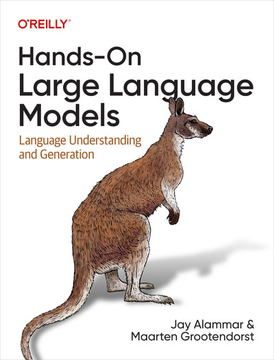

# Hands-On Large Language Models

La IA ha adquirido sorprendentes capacidades lingüísticas en los últimos años. Impulsados ​​por los rápidos avances en el aprendizaje profundo, los sistemas de IA lingüística pueden escribir y comprender textos mejor que nunca. Esta tendencia está dando lugar a nuevas funciones, productos e industrias enteras. Gracias al enfoque didáctico y visual de este libro, los lectores aprenderán las herramientas y los conceptos prácticos necesarios para utilizar estas capacidades hoy mismo.

Aprenderás a utilizar modelos de lenguaje preentrenados de gran tamaño para casos de uso como la redacción publicitaria y la creación de resúmenes; a crear sistemas de búsqueda semántica que vayan más allá de la coincidencia de palabras clave; y a utilizar bibliotecas existentes y modelos preentrenados para la clasificación, la búsqueda y la agrupación de textos.

Este libro también te ayuda a:
- Comprenda la arquitectura de los modelos de lenguaje Transformer que destacan en la generación y representación de texto.
- Cree flujos de trabajo LLM avanzados para agrupar documentos de texto y explorar los temas que abarcan.
- Construye motores de búsqueda semántica que vayan más allá de la búsqueda por palabras clave, utilizando métodos como la recuperación densa y los reordenadores.
- Explora cómo se pueden utilizar los modelos generativos, desde la ingeniería de indicaciones hasta la generación aumentada por recuperación.
- Adquiera un conocimiento más profundo de cómo entrenar modelos de lenguaje natural (LLM) y optimizarlos para aplicaciones específicas mediante el ajuste fino de modelos generativos, el ajuste fino contrastivo y el aprendizaje en contexto.